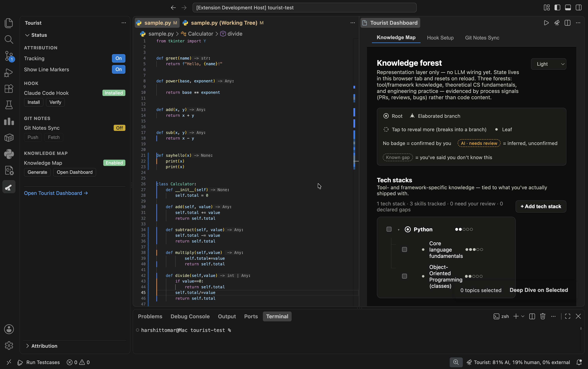

# Tourist

**Live, per-line attribution of who — or what — wrote each line in your workspace: Claude Code, you, or something else.**

Tourist watches your files as you work and colors every line by where it came from. When a line changes and you didn't type it, most tools just assume "AI did it." Tourist doesn't guess — if it can't prove a change came from Claude Code, it marks it **external/unknown** instead of silently calling it AI.

## How attribution works

Every line lands in one of three buckets, based on the evidence Tourist actually has:

- **AI** (blue) — Claude Code told Tourist it made this edit, via a hook on its `PreToolUse`/`PostToolUse` events for `Edit`/`Write`/`MultiEdit`. This is a direct, ground-truth signal. Lines missing that direct signal can still land here on corroborating evidence (Claude Code's IDE lock file, a process trail), at lower confidence.
- **Human** (orange) — you typed it. If the file was already "dirty" (unsaved changes) right before and after the edit, it came from typing, not a tool.
- **External / unknown** (dashed magenta, `?` icon) — something wrote to disk with no evidence it was Claude Code: a formatter, another tool or AI, a git operation, anything else. This is the deliberate honest-uncertainty bucket — Tourist never defaults an unexplained change to "AI."

Lines nobody has touched yet (the checked-in baseline) aren't decorated.

## Features

- **Activity Bar & Dashboard** — Tourist's own Activity Bar icon (the telescope) opens a **Status** sidebar view and an **Attribution** rollup tree. From Status you can open the **Tourist Dashboard**, a tabbed panel covering Knowledge Map, Hook Setup, and Git Notes Sync. The older **Tourist: Open Menu** quick-pick still works too, but the Activity Bar/Dashboard is where new functionality lives.
- **Gutter decorations** — every attributed line gets a colored left-edge marker (blue AI, orange human, dashed magenta external with a `?` icon), with a hover tooltip explaining the call. Updates live as you edit, save, and switch files.

  <!-- TODO screenshot: close-up of the gutter showing all three decoration styles side by side, with one tooltip open on hover. -->

- **Status bar rollup** — a bottom-right status bar item shows the workspace-wide attribution split as a percentage (e.g. `Tourist: 40% AI, 45% human, 15% external`); click it to open the Workspace Attribution view.

  <!-- TODO screenshot: status bar item with a real percentage breakdown visible. -->

- **Knowledge Map** (opt-in, off by default) — tracks *what you actually understand* — tech stacks, CS fundamentals, engineering practice — from evidence in your own repo activity (git diffs and commit messages, plus your real Claude Code transcripts if you separately opt in), classified by Claude against a knowledge-forest taxonomy. Fully consent-gated: nothing runs until you trigger **Tourist: Generate Knowledge Map**, and you review, confirm, reject, rename, or re-run analysis on every node yourself via the Dashboard.

  

For the full command list, use the Command Palette filtered to "Tourist:". For full configuration details (retention days, exclusion globs, git-notes remote, Knowledge Map backend/model/lookback), see Settings under the **Tourist** category in VS Code.

### Dual persistence

Attribution history is always saved locally (VS Code global storage, keyed by content hash so it survives file renames), with zero configuration and no network calls. Optionally enable `tourist.gitNotesSync` to also share history with a team via git notes (`refs/notes/tourist-attribution`) — syncing is entirely manual, via **Tourist: Push/Fetch Attribution Notes**.

## How to run it

- Requires VS Code `^1.85.0`, and the [Claude Code](https://claude.com/claude-code) CLI (with the Tourist hook installed via **Tourist: Install Claude Code Hook**) for the ground-truth AI signal.
- From source: Node.js `>=18`, then `npm install`, `npm run build` (or `npm run watch`), `npm test`. Press `F5` in VS Code to launch an Extension Development Host.
- Knowledge Map's analyser is a separate subpackage, never statically bundled into Tourist — build it once with `cd ideation/knowledge-forest/analyser && npm install && npm run build` before trying the feature from a dev build.

See [ARCHITECTURE.md](ARCHITECTURE.md) for how the code is organized and how attribution decisions are made under the hood.

## Built with AO (Agent Orchestrator)

Tourist was built by orchestrating multiple specialized AO worker agents rather than as one continuous session: agents work on branches and open pull requests, dedicated reviewer agents leave real approve/request-changes verdicts, and only reviewed work gets merged.

- **Parallel module split, then integration** — the initial build split into independently-owned modules (detection engine, persistence/git layer, VS Code UI, a research spike) built in parallel on separate branches, then merged and reconciled by a dedicated consolidation pass.
- **Integration bugs really did show up at merge time** — e.g. two parallel Knowledge Map agents both picked the flag name `--forest` for different things (an output path vs. a list of forest kinds), silently zeroing every run until an integration agent caught and fixed it.
- **Independent reviewer personas caught bugs a single build likely would have shipped** — a "senior" and "junior" persona review of the same codebase turned up a data-loss bug in branch/stash handling, a "Re-review" button that silently no-op'd for most nodes, and a persistence key-collision bug — all fixed via follow-up PRs and re-review.
- **Later features used an explicit interface contract** between the agent owning an API/CLI surface and the agent owning its consumer, with a dedicated integration agent verifying both sides end-to-end before merge.
