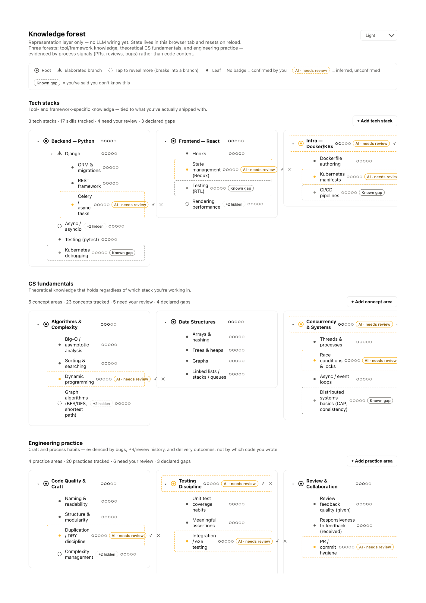
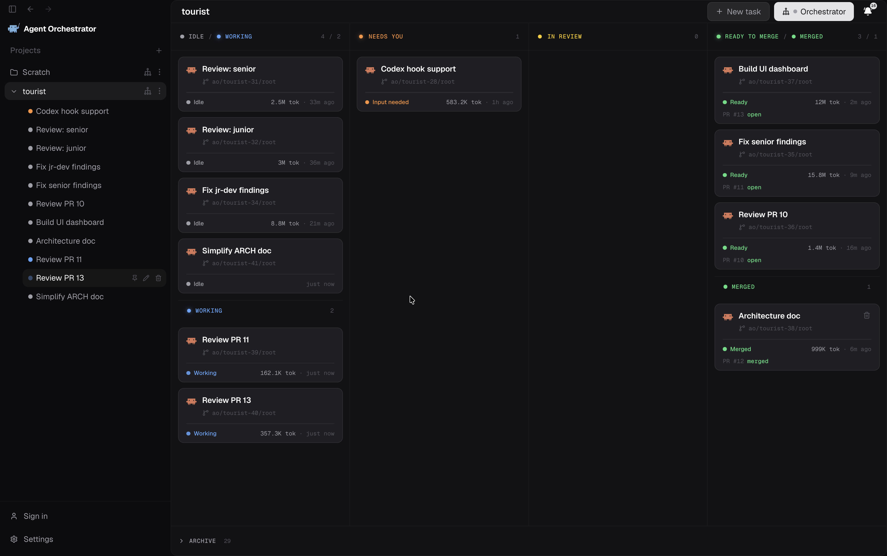

# Tourist

**Live, per-line attribution of who — or what — wrote each line in your workspace: Claude Code, you, or something else.**

Tourist watches your files as you work and colors every line by where it came from. It's built for one specific problem: when a line changes on disk and you didn't type it, most tools just assume "AI did it." Tourist doesn't guess — if it can't prove a change came from Claude Code, it marks it **external/unknown** instead of silently calling it AI.

<!-- TODO screenshot: hero shot — an editor with a mix of blue/orange/dashed-magenta decorated lines. Manual capture: open a file with AI, human, and formatter-driven edits, screenshot the gutter. -->

## How attribution works

Every line ends up in one of three buckets, decided by how much evidence Tourist actually has:

- **AI** (blue) — Claude Code told Tourist it made this edit. Tourist installs a hook into Claude Code's `PreToolUse`/`PostToolUse` events (for `Edit`, `Write`, and `MultiEdit` tool calls), so this is a direct, ground-truth signal, not a guess. Lines where Claude Code wrote to disk but the hook signal was missing can still land here if Tourist finds corroborating evidence — e.g. Claude Code's own IDE lock file, or a shell/process trail — but with lower confidence than the direct hook signal.
- **Human** (orange) — You typed it. If the file was already "dirty" (had unsaved changes) right before and after the edit, Tourist knows it came from typing in the editor, not from Claude Code or another tool.
- **External / unknown** (dashed magenta, with a `?` icon) — Something wrote to disk and Tourist has no evidence it was Claude Code: a formatter, another tool, another AI, a Git operation, or anything else. This is the deliberate honest-uncertainty bucket — Tourist never defaults an unexplained change to "AI."

Lines nobody has touched yet (the checked-in baseline) aren't decorated at all.

## Features

### Tourist Activity Bar & Dashboard

Tourist has its own icon in the Activity Bar (the telescope). Opening it gives you two views:

- **Status** — a sidebar webview with live tracking/markers toggles, the Claude Code hook's install status (with one-click Install/Verify), git-notes sync status (with one-click Push/Fetch), a Knowledge Map row (Generate/Open Dashboard), and a footer link into the full Dashboard.
- **Attribution** — the same folder → file attribution rollup tree that used to live under the built-in Explorer panel, now nested under Tourist's own icon instead.

From Status (or via **Tourist: Show Knowledge Map**), you can open the **Tourist Dashboard**, a tabbed webview panel with:

- **Knowledge Map** — see [below](#knowledge-map-opt-in).
- **Hook Setup** — install/verify the Claude Code hook without leaving the panel.
- **Git Notes Sync** — push/fetch attribution notes without leaving the panel.

This is now the primary way to discover and control Tourist. The older **Tourist: Open Menu** command (telescope icon in the editor title bar) still works and stays registered for backward compatibility, but the Activity Bar/Dashboard surface is where new functionality (like Knowledge Map) actually lives.

<!-- TODO screenshot: Activity Bar telescope icon expanded, showing the Status view and the Dashboard panel open on the Knowledge Map tab. -->

### Gutter / line decorations

Every attributed line gets a colored left-edge marker in the editor gutter (`src/vscode-integration/decorations.ts`):

| Attribution | Style | Color |
|---|---|---|
| AI | solid border | blue (`#3b82f6`) |
| Human | solid border | orange (`#f0883e`) |
| External / unknown | **dashed** border + `?` gutter icon | magenta (`#c026d3`) |

Hovering a decorated line shows a tooltip ("Tourist: written by Claude Code" / "written by you" / "written by something else"). Decorations update live as you open files, switch editors, type, save, and whenever a Tourist setting changes.

<!-- TODO screenshot: close-up of the gutter showing all three decoration styles side by side, with one tooltip open on hover. -->

### Status bar rollup

A status bar item (bottom right) shows the workspace-wide attribution split as a percentage — e.g. `Tourist: 40% AI, 45% human, 15% external`. Click it to open the Workspace Attribution view.

<!-- TODO screenshot: status bar item with a real percentage breakdown visible. -->

### Knowledge Map (opt-in)

Off by default (`tourist.knowledgeMap.enabled`). Where the rest of Tourist tracks *who wrote a line*, Knowledge Map tries to track *what you actually understand* — which topics/skills (tech stacks, CS fundamentals, engineering practice) a developer has demonstrated real command of, based on evidence from your own repo activity.

- **Evidence & backend** — Tourist gathers your recent git diffs and commit messages (and, only if you separately opt in via `tourist.knowledgeMap.includePrompts`, your real Claude Code session transcripts) and sends them to Claude to classify against a knowledge-forest taxonomy. Two backends are supported: the **local `claude` CLI** you're already logged into (`tourist.knowledgeMap.claudeBackend: "cli"`, the default — no separate API key to manage), or a direct **Anthropic API key** (`"api-key"`, stored in VS Code's secret storage, never in plain settings).
- **Consent** — nothing runs until you explicitly trigger **Tourist: Generate Knowledge Map**, and a one-time consent dialog gates it; a separate, more explicit consent dialog gates `includePrompts` specifically, since it sends raw conversation history rather than just code.
- **Review workflow** — **Tourist: Show Knowledge Map** opens the forest in the Dashboard's Knowledge Map tab as a tree you interact with directly: **confirm** or **reject** an AI-inferred node (moves it to a confirmed/gap state), **rename**, **add a child**, or **delete** a node, multi-select nodes for a **Deep Dive** (a follow-up analysis pass focused just on those topics), or trigger a **Re-review** on any already-confirmed/gap node to re-run analysis against just that topic.



### Commands

All available from the Command Palette, or via the Tourist Activity Bar icon / Dashboard described above. The telescope icon in the editor title bar (**Tourist: Open Menu**) also still opens a quick-pick shortcut to the same actions:

| Command | What it does |
|---|---|
| `Tourist: Open Menu` | Quick-pick menu of Tourist actions |
| `Tourist: Toggle Attribution Tracking` | Turn recording on/off (existing markers are kept, nothing new is saved while off) |
| `Tourist: Toggle Attribution Line Markers` | Show/hide the gutter decorations without affecting recording |
| `Tourist: Install Claude Code Hook` | Installs the `PreToolUse`/`PostToolUse` hook Tourist needs for ground-truth AI detection |
| `Tourist: Verify Claude Code Hook` | Checks that the hook is installed and pointing at the right script |
| `Tourist: Open Workspace Attribution View` | Opens/focuses the Attribution sidebar view |
| `Tourist: Push Attribution Notes` | Pushes local attribution history to `refs/notes/tourist-attribution` on the configured remote (requires `tourist.gitNotesSync`) |
| `Tourist: Fetch Attribution Notes` | Fetches and merges attribution history from the remote (requires `tourist.gitNotesSync`) |
| `Tourist: Generate Knowledge Map` | Runs the (consent-gated, opt-in) Knowledge Map analysis pass |
| `Tourist: Show Knowledge Map` | Opens the Tourist Dashboard on the Knowledge Map tab |

### Settings

| Setting | Default | What it does |
|---|---|---|
| `tourist.attributionTracking` | `true` | Record AI/human/external attribution as you edit. Off = existing markers stay frozen, nothing new is recorded. |
| `tourist.showAttributionMarkers` | `true` | Show the gutter decorations. Off hides them without affecting recording. |
| `tourist.attributionRetentionDays` | `3` | How many days a file's attribution markers survive across restarts before aging out. |
| `tourist.exclusionPolicy` | `[]` | Extra gitignore-style globs to exclude, on top of `.gitignore` and built-in defaults (`node_modules/`, build output, `.git/`). |
| `tourist.gitNotesSync` | `false` | Off by default — no network calls at all. When on, Push/Fetch Attribution Notes sync `refs/notes/tourist-attribution` with a remote so a team can share attribution history. |
| `tourist.gitNotesRemote` | `"origin"` | The git remote used by Push/Fetch, when `gitNotesSync` is on. |
| `tourist.knowledgeMap.enabled` | `false` | Master opt-in for Knowledge Map. Off = Generate/Show commands do nothing but point you at this setting. |
| `tourist.knowledgeMap.claudeBackend` | `"cli"` | `"cli"` rides your logged-in `claude` CLI session; `"api-key"` calls the Anthropic API directly using a key from VS Code's secret storage. |
| `tourist.knowledgeMap.claudeCliPath` | `"claude"` | Path to the Claude Code CLI executable, used when the backend is `"cli"`. |
| `tourist.knowledgeMap.model` | `"claude-sonnet-5"` | Claude model used for Knowledge Map analysis. |
| `tourist.knowledgeMap.since` | `"30 days ago"` | How far back to look for git history (anything `git log --since` accepts). |
| `tourist.knowledgeMap.maxCommits` | `20` | Cap on recent commits considered as evidence. Lower for cheaper/faster runs, raise for a deeper pass. |
| `tourist.knowledgeMap.forestKinds` | `["tech", "cs", "practice"]` | Which knowledge-forest categories to classify evidence into. |
| `tourist.knowledgeMap.includePrompts` | `false` | Off by default. When on, also reads your real Claude Code session transcripts as extra evidence — gated by its own separate consent dialog. |

### Dual persistence

Tourist saves attribution history two ways:

- **Local (always on, default)** — every workspace's attribution history is written to a JSON file in VS Code's global storage, keyed by repo path and branch. Entries are keyed by a **content hash**, not file path, so attribution survives file renames. Writes are atomic. This works with zero configuration and never touches the network.
- **Git notes (opt-in)** — set `tourist.gitNotesSync` to `true` to enable syncing attribution history as git notes (`refs/notes/tourist-attribution`) so a team can share it. Syncing is entirely manual: run **Tourist: Push Attribution Notes** or **Tourist: Fetch Attribution Notes** yourself. There's no automatic sync on commit — nothing goes over the network unless you run one of those two commands with the setting enabled.

## Requirements

- VS Code `^1.85.0`
- For building from source: Node.js `>=18`
- [Claude Code](https://claude.com/claude-code) CLI, with the Tourist hook installed via **Tourist: Install Claude Code Hook**, for the ground-truth AI signal
- For Knowledge Map specifically: either the `claude` CLI logged in locally (default backend), or an Anthropic API key (if you switch `tourist.knowledgeMap.claudeBackend` to `"api-key"`)

## Development

```bash
npm install
npm run build      # one-off esbuild bundle
npm run watch       # rebuild on change
npm test            # vitest run
```

Other scripts in `package.json`: `npm run compile` (`tsc --noEmit` + build), `npm run package` (production esbuild), `npm run test:watch` (vitest watch mode), and `npm run test:e2e` (real extension-host tests via `@vscode/test-electron`; run `npm run pretest:e2e` once first to build the test bundle).

Press `F5` in VS Code to launch an Extension Development Host with Tourist loaded (see `.vscode/launch.json`).

### Trying Knowledge Map locally

Knowledge Map's analysis engine (`ideation/knowledge-forest/analyser`) is a separate, self-contained subpackage with its own `package.json` — it's never statically imported into Tourist's own build, only spawned as a CLI subprocess. To try the feature from a dev build, build it once before launching the Extension Development Host:

```bash
cd ideation/knowledge-forest/analyser
npm install
npm run build   # tsc -p tsconfig.build.json -> dist/
```

Then, in the running extension, turn on `tourist.knowledgeMap.enabled` and run **Tourist: Generate Knowledge Map**. If the analyser's `dist/` isn't built yet, Tourist's Knowledge Map commands will tell you rather than failing silently.

<!-- TODO screenshot: Command Palette filtered to "Tourist:" showing the full command list. -->

## Built with AO (Agent Orchestrator)

Tourist was built by orchestrating multiple specialized AO worker agents rather than as one continuous session. The workflow, throughout: agents work on branches and open pull requests, never commit straight to `main`; dedicated reviewer agents leave real approve/request-changes-style verdicts (as PR review docs and follow-up fix PRs); only reviewed work gets merged.

Here's what it actually looked like — the AO board mid-build, with worker agents in flight across Idle/Working, Needs You, In Review, and Ready to Merge/Merged, each tied to a real PR:



**Parallel module split, then integration.** The initial build split the extension into independently-owned modules built by separate agents in parallel — a core detection engine, a persistence/git-integration layer, the VS Code UI layer, and a Phase 0/1 research spike — each on its own branch (see the `Merge Agent B's persistence layer`, `Merge Agent C's vscode-integration layer` commits). These were then merged into one integration branch and reconciled by a dedicated consolidation pass (`CONSOLIDATION_REPORT.md`, PR #1), which documented what merged cleanly versus what needed real fixing.

**Integration bugs really did show up at merge time.** The independently-built pieces didn't always compose on the first attempt. One concrete example: when Knowledge Map was later split into two parallel agents — one building the analyser CLI's flags, one building the extension-side UI that spawns it — the two sides settled on the same flag name, `--forest`, for two different things (an output *path* on the UI side, a comma-separated list of forest *kinds* on the CLI side). The mismatch silently filtered every run to zero categories and no-op'd. A dedicated integration agent caught it while verifying the two halves end-to-end and fixed it by switching the UI to the CLI's actual `--out` flag (commit `a639056`).

**Reviewer personas caught bugs a single build likely would have shipped.** A recurring pattern: a "senior engineer" persona agent and a "junior developer" persona agent independently reviewed the same codebase (`REVIEW_SENIOR.md`, `REVIEW_JRDEV.md`, and later review rounds), on the theory that the two perspectives catch different classes of bugs. Dedicated fix agents then addressed the findings, followed by re-review. This caught several genuinely serious bugs, including:
- A **data-loss bug** in git branch/stash handling — switching branches or running `git stash push`/`pop` on a still-open file silently wiped all of its AI/human attribution history, because a fully-built `BranchWatcher` had never actually been wired into `extension.ts`, and a git-caused content revert on an already-open document never re-fetched its persisted history (fixed in PR #4/#5).
- A **headline feature that silently did nothing** for most of its own UI: Knowledge Map's "Re-review" button sent only a node's bare label instead of the full root-to-node ancestor path the merge logic matched against, so re-review silently no-op'd for every node except ones at the forest root (fixed in PR #11).
- A **persistence key-collision bug** where two unrelated entries with byte-identical line text (e.g. a lone `}`) anywhere in the same repo/branch store could silently overwrite each other on save, regardless of file or location (also fixed in PR #11).

**Later features used an explicit interface contract between parallel agents.** Knowledge Map's build (PRs #3, #6, #8) split cleanly along a contract: one agent owned the analyser's CLI surface (flags, forest schema, Claude backend selection), another owned the VS Code extension/webview side that calls it, and a dedicated integration agent verified the two sides actually worked together end-to-end before merge — which is exactly the pass that caught the `--forest`/`--out` mismatch above.

Later still, the same pattern applied to the UI consolidation (PR #13, the Activity Bar/Dashboard rework) and the architecture documentation (PR #12/#14): scoped feature work on its own branch, a PR with an explicit test plan, and merge only after review.
